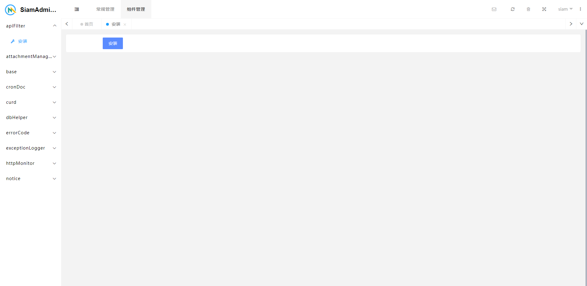
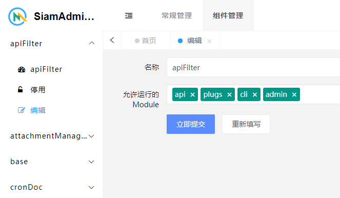
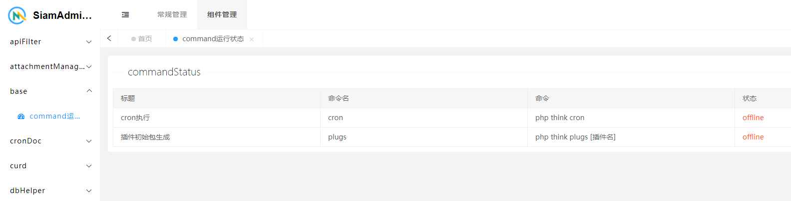

# Base插件介绍

Base组件为系统强制内置组件，它提供了其他组件的一些基础功能和管理。

## 安装插件

第一次运行插件的时候，需要安装，生成插件运行所需的环境配置：如数据库、配置文件等

对于运营数据的考虑，暂不设计卸载功能，一般情况下也无需卸载。使用停用插件即可。



## 开启/停用插件

如题，就是该系统是否开启该插件的功能。

在请求到达时，系统将会执行所有 `已安装并且开启状态` 的插件的 `init` 事件：如注册路由、注册命令行等。

如果停用插件，则不执行，可以避免性能浪费。

## 编辑插件

对相应的组件设置运行模块,设置的组件只有在允许的模块下才会运行

举例下图中 规定了 apiFilter 组件的运行模块，目的也是为了避免性能浪费，只在需要加载的时候加载运行。

模块的定义 查看框架规范说明



## 查看命令行

command状态监控可以查看系统内所有支持的命令行说明，以及在线状态（如果有向管理器发送心跳包的话）

通过在线状态的查看，就可以方便地查看开启了那些功能命令，可以便于停止进程的运行



规范：所有组件的自定义命令（workerman类）都需要向base管理器发送心跳包

```php
use app\plugs\base\service\PlugsCommandStatus;
use Workerman\Lib\Timer;

Timer::add(1,function (){
    PlugsCommandStatus::ping('插件名');
});
```

