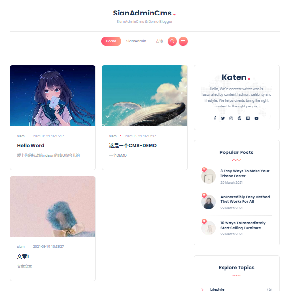
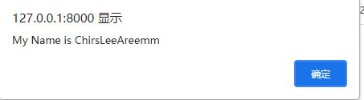

# Cms插件
一个简易的Cms搭建脚本，可以自定义模板，预置了文章管理，和文章脚本
## 安装
和其他的插件一样的安装和启动流程
```
我们在模板渲染中，使用了ThinkPHP官方的模板引擎，请先确认是否已安装 ： 
安装方法 ： composer require topthink/think-view

插件安装完后的文件夹结构
app/plugs/cms
    --controller
        ...
    --model
        ...
    --service
        ...
    --template
        ...
    --view
        ...
    Plugs.php
```
## 查看DEMO
我们内置了一个简单的博客DEMO,以便于大家熟悉该插件的使用
```base
以本地开发模式启动项目
>php think run
ThinkPHP Development server is started On <http://127.0.0.1:8000/>
You can exit with `CTRL-C`

```
浏览器中访问地址 http://127.0.0.1:8000/cms/index.html



## 如何开发

### 一 添加模板
```
html文件 
    app/plugs/cms
        --template
            --default（模板文件夹，根据实际项目命名） 此文件夹存放的是html模板文件
            
静态资源文件
    public/cms
        --default（模板文件夹，根据实际项目命名） 此文件夹存放的是静态资源文件
```
html模板文件中,将静态资源引入的路径改变成模板变量路径
```angular2html
{__CMS__} 就是模板替换变量，配置的文件在 config/view.php
<link rel="stylesheet" href="{__CMS__}/default/css/bootstrap.min.css" type="text/css" media="all">
```

### 二 模型文件
插件的模型文件也是通过CURD插件生成的，存放的路径在plugs相应的插件目录下，和Admin后台的模型存放路径不同
```
app/plugs/cms
    --model
```

### 三 模板控制器
模板控制器命名规则为 CmsXXXTemplateController

这是Default项目的控制器：
```angular2html
app/plugs/cms
    --controller
        CmsDefaultTemplateController.php 

```
控制器开发中的重要内容 **CmsArticleService**
```php
<?php


namespace app\plugs\cms\controller;


use app\plugs\cms\model\PlugsCmsArticleModel;
use app\plugs\cms\service\CmsArticleService;
use think\facade\App;
use think\facade\View;

class CmsDefaultTemplateController
{
    //.....
}
```
在控制器的use中，要注意 ```app\plugs\cms\service\CmsArticleService``` 这个文件
所有的数据获取以及数据接口，都写在了```CmsArticleService```中

之所以不写在控制器中，是因为考虑到了需要兼容 前后端分离模式的管理后台的数据接口，和模板渲染模式的前端模板控制器的接口。

所以我们在CmsArticleService中返回一致的兼容数据格式，减少代码量和工作量

**规范在后续开发和使用的过程中，新开发的数据接口也要遵循此规范，以便于数据操作的集中管理。**


### 文章脚本

####创建

我们可以通过在后台定义独立的脚本,以及将文章和脚本进行绑定，来赋予一篇文章实现绑定的脚本的功能


流程如下：


在后台 Cms插件管理-文章脚本页，添加或编辑脚本，如上图示例


在文章列表中 添加或编辑 文章, 其中就可以选择已创建的文章脚本

#### 脚本内容规范
```angular2html
注意，在脚本内容中，需要统一使用作用域包围脚本代码，以避免变量冲突，
我们在添加脚本内容的时候，也需要尽量避免和其他脚本可能存在的冲突情况。
$(function(){
 ...code
});
```
实际上，这和直接写一段Js文件没什么不同，但是优势在于
该文章脚本可以指定一个或多个文章同时实现脚本，也可以在管理后台轻松更改脚本内容。

#### 实现

在DEMO的模板控制器中，我们演示了如何去实现文章脚本，具体看```article_script```方法

```php
<?php


namespace app\plugs\cms\controller;


use app\plugs\cms\model\PlugsCmsArticleModel;
use app\plugs\cms\service\CmsArticleService;
use think\facade\App;
use think\facade\View;

class CmsDefaultTemplateController
{
    /**
     * 获取脚本内容
     * @throws \app\exception\ServiceException
     * @throws \think\db\exception\DataNotFoundException
     * @throws \think\db\exception\DbException
     * @throws \think\db\exception\ModelNotFoundException
     */
    public function article_script()
    {
        validate(['article_id'=>'require'],['文章ID不能为空'])->check(input());
        $article_id = input('article_id');
        echo CmsArticleService::get_article_script($article_id);die;
    }
}
```
为什么要用 ```echo CmsArticleService::get_article_script($article_id);die;```输出

其中是关于ThinkPHP6的debug模式下，无法动态的关闭debug调试问题,
return 会让调试内容的html跟随渲染，导致脚本内容混淆无法识别。
为了兼容debug 模式下的使用，die让脚本输出之后，后续的debug的html不再渲染。

#### 页面渲染
```
app/plugs/cms
    --template/default/article.html
```
在```article.html``` 最后几行，可以看到脚本是如何被引用的,我们使用模板请求了```article_script```接口
```angular2html
<script type="text/javascript" src="{:url('cms/article_script',['article_id'=>$article_info['article_id']])}"></script>
```
当进入文章时，脚本自动触发



