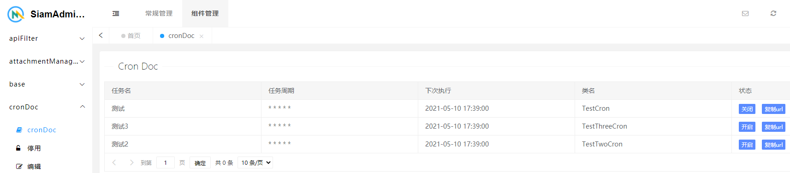

# Cron面板
提供定时任务在线可视化操作

## 声明一个定时任务

-  app
-- cron 目录，为定时任务存放目录

创建一个定时任务类，继承同级目录中的 CronBase

可以参考系统自带的两个测试任务 TestCron 、 TestTwoCron

**声明完成后在组件首页列表刷新，会自动识别到新增的定时任务**




## 查看执行记录

```
任务执行的Log文件路径 ： app\runtime\cron\xxx.log
```

## 在线启动/关闭 任务

在列表<状态>一栏中，可选择在线 开启/关闭 任务的执行 ，这个操作是实时的。

## 复制任务url

在列表<状态>一栏中，可以点击复制url ，获取任务执行的url

## 如何运行定时任务

有两种方式

- 使用SiamAdmin内置的 cron runner ，开启命令为`php think cron`
- 使用系统级的定时任务，访问任务url
