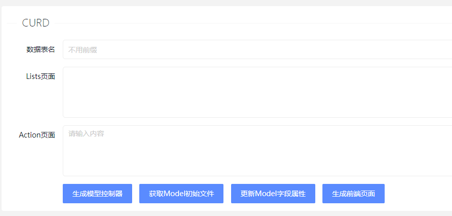

# CURD插件

一键生成控制器、模型等，这个应该是很常见的功能。

相比其他Admin系统，SiamAdmin的优势：增加了注释字段的生成、更新

生成前端页面html代码、生成Model代码（可以复制到别的非SiamAdmin项目中使用）

> 生成完成之后，要到权限菜单中新增~

- 生成模型控制器： 普通生成 直接生成文件在对应目录中
- 获取Model初始文件：返回Model文件的内容，不生成文件
- 更新Model字段属性：开发过程中，调整了表结构，一键同步字段注释
- 生成前端页面：html代码 复制到前端目录中存放