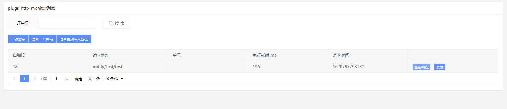

# 请求监控

记录请求的路径、参数、响应内容等

它在开发`微信公众平台`、`小程序` 等 有异步回调类型的应用时候，非常的有用。



- 复发功能：下单支付一笔微信支付订单，产生一条回调，但此时接口逻辑不完善 导致奔溃，那么我们直接修改代码，然后点击复发即可重新跑一次逻辑，而无需重新下单
- 查看响应：可以查看响应的数据是否为预期


## 代码内临时调试日志

- 作为程序内部一些日志的记录，如curl 等第三方接口的响应数据等，同时可以通过订单号做筛选
- 可以单独调用SceneRequestMonitor，而不调用SceneResponseMonitor，作为一个订单号的数据库日志记录

```php
use app\plugs\httpMonitor\service\SceneRequestMonitor;
use app\plugs\httpMonitor\service\SceneResponseMonitor;

$id = SceneRequestMonitor::run('/test', '订单号', ['data' => 1]);
$curl_res = Curl::post('/test', ['data' => 1]);
SceneResponseMonitor::run($id, $curl_res);
```
